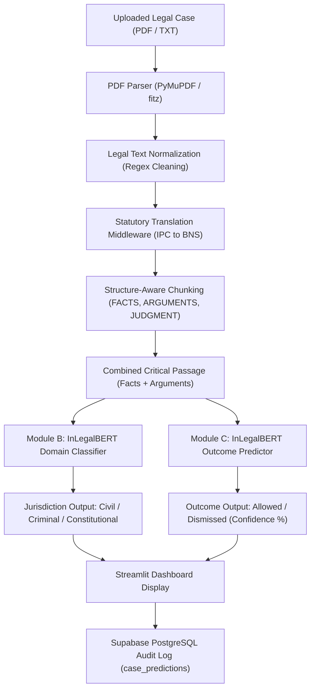

# ⚖️ Agent Guide: Realistic Legal Justice Prediction (Legal AI Hub)

> **Document Purpose**: This file serves as the definitive, single-source-of-truth architectural and technical manual for any AI agent or developer working on, extending, or maintaining the **Realistic LJP (Legal AI Hub)** codebase.

---

## 1. Executive Summary & Project Purpose

### 1.1 The Real-World Judicial Problem
In the Indian Judicial System, over **45 to 50 million cases** are currently pending across District Courts, High Courts, and the Supreme Court. A significant bottleneck is the manual analysis of lengthy appellate petitions (30 to 100+ pages) and lower-court trial records. 
Key systemic challenges include:
1. **Document Overload**: Judicial officers and advocates spend hours reading unstructured legal judgments to extract key arguments, statutory citations, and procedural histories.
2. **Outcome Uncertainty**: Litigants and advocates lack objective, data-driven foresight into appellate viability (whether an appeal is statistically likely to be *Allowed* or *Dismissed*).
3. **The "Black Box" Resistance**: Legal professionals cannot adopt generic "black box" machine learning models; judges and advocates require transparent rationale, statutory citations, and explainability.
4. **The 2024 Indian Penal Reform**: Effective July 1, 2024, India replaced the 164-year-old **Indian Penal Code (IPC 1860)** with the **Bharatiya Nyaya Sanhita (BNS 2023)**, creating an urgent need for automated statutory cross-referencing.

### 1.2 The Systemic Solution: Legal AI Hub
**Legal AI Hub** is an end-to-end, enterprise-grade decision-support platform designed specifically for the Indian legal domain. It combines:
- **Domain-Specific Transformer NLP**: Fine-tuned `InLegalBERT` models for dual-task prediction (Legal Jurisdiction & Appellate Outcome).
- **Structure-Aware Document Processing**: Extraction of unstructured court judgment PDFs, bypassing transformer token limits via structural segmenting (`FACTS`, `ARGUMENTS`, `JUDGMENT`).
- **Statutory Translation Middleware**: Seamless real-time mapping between legacy IPC sections and modern BNS provisions.
- **Enterprise Role-Based Access Control (RBAC)**: Tailored workflows for Judges, Lawyers, Law Students, and System Administrators.
- **Persistent Cloud Knowledge Repository**: Cloud database integration via Supabase (PostgreSQL) for case vaulting, chat inquiries, and prediction audit histories.

---

## 2. Directory Structure & File Map

Following the project cleanup, the root workspace is streamlined to essential runtime components, while academic artifacts, presentations, and draft documents are organized under `Documents/`:

```
Realistic_LJP/
│
├── app.py                      # Core application: Streamlit UI, RBAC router, inference logic, Supabase client
├── bns_mapping.json            # Statutory dictionary mapping IPC sections to BNS provisions & descriptions
├── migration.sql               # PostgreSQL schema & RLS policies for Supabase database tables
├── requirements.txt            # Python dependencies (Streamlit, PyTorch, Transformers, Supabase, PyMuPDF, etc.)
├── README.md                   # Repository overview, quickstart instructions, and Hugging Face model links
├── agent.md                    # THIS FILE: Complete agent architecture and runtime technical reference
│
├── .streamlit/
│   ├── config.toml             # Streamlit visual theme tokens (Professional White UI configuration)
│   └── secrets.toml            # Credentials for Supabase connection (SUPABASE_URL, SUPABASE_KEY)
│
├── models/                     # Local fine-tuned model weights and tokenizer configurations
│   ├── Module_B/Final/         # Module B: Jurisdiction/Domain Classifier (Civil vs Criminal vs Constitutional)
│   │   ├── config.json         # BERT classification head configuration (3 labels)
│   │   ├── model.safetensors   # Fine-tuned weights (~438 MB)
│   │   ├── tokenizer.json      # InLegalBERT tokenizer vocabulary
│   │   ├── tokenizer_config.json
│   │   └── training_args.bin   # Training arguments binary
│   │
│   └── Module_C/Final/         # Module C: Outcome Predictor (Dismissed vs Allowed)
│       ├── config.json         # BERT classification head configuration (2 labels)
│       ├── model.safetensors   # Fine-tuned weights (~438 MB)
│       ├── tokenizer.json      # InLegalBERT tokenizer vocabulary
│       ├── tokenizer_config.json
│       └── training_args.bin   # Training arguments binary
│
└── Documents/                  # Archived academic reports, drafts, datasets, and presentation materials
    ├── AI_for_Legalcase_Outcome_Prediction_Paper.zip
    ├── BNS_IPC_Comparative.pdf
    ├── BTech project Final Black book report format 24-25-1.docx
    ├── In our word or reseach paper.docx
    ├── Issues face while making project-.txt
    ├── 🎤 Final Year Project Presentation Script.docx
    ├── Front end SS/           # Screenshots of system interface
    ├── Research paper doc/     # Academic papers, blackbook report chapters, and architecture diagrams
    ├── Model Test pdfs/        # Sample Supreme Court & High Court judgment PDFs for testing
    ├── information.md          # Comprehensive interview preparation & technical project guide
    ├── implementation_summary.md
    ├── build_ui.py             # Previous code-generation script
    ├── test_app.py             # Tailwind CSS validation test script
    └── requirement.txt         # Deprecated redundant requirement file
```

---

## 3. Technology Stack & Architectural Dependencies

| Layer | Component | Version / Identifier | Purpose |
| :--- | :--- | :--- | :--- |
| **Frontend UI** | Streamlit | `>=1.32.0` | High-performance reactive web application dashboard |
| **Language** | Python | `3.10+` | Core development runtime |
| **Deep Learning** | PyTorch & Transformers | `torch>=2.2.0`, `transformers>=4.38.0` | Model execution, tensor management, classification heads |
| **Foundation LLM** | `law-ai/InLegalBERT` | Hugging Face Hub | Domain-adapted BERT pre-trained on Indian Supreme Court judgments |
| **Remote Model Hub** | Hugging Face Model Hub | `Nick1027/legal-case-outcome-predictor` | Cloud backup of Module B & C checkpoints |
| **Document Parser**| PyMuPDF (`fitz`) | `>=1.23.21` | High-speed PDF stream parsing and plain-text extraction |
| **Database & Auth**| Supabase Cloud | `supabase>=2.0.0` | PostgreSQL hosting, JWT-based user authentication, Row-Level Security |
| **Data Handling**  | Pandas & NumPy | `pandas>=2.2.0`, `numpy>=1.26.0` | Tabular data processing for audit logs & metrics |
| **Data Dict**      | `bns_mapping.json` | Local JSON | Structured key-value mapping of Indian Penal Code to BNS |

---

## 4. Machine Learning & Inference Pipeline

The system uses a **hierarchical dual-transformer pipeline** supported by heuristic fallbacks:



### 4.1 Foundation Model: InLegalBERT
Standard transformer models (such as BERT, RoBERTa, or general LLMs) struggle with Indian legal texts due to specialized legal vocabulary (*Coram*, *impugned judgment*, *prima facie*, *suo motu*, *habeas corpus*), procedural formatting, and statutory citations. 
This project leverages **InLegalBERT** (`law-ai/InLegalBERT`), which was pre-trained on a corpus of over 5.4 million words from Indian Supreme Court rulings.

### 4.2 Module B: Domain & Jurisdiction Classifier
- **Location**: `./models/Module_B/Final`
- **Output Labels**:
  - `0`: Civil Law
  - `1`: Criminal Law
  - `2`: Constitutional Law
- **Architecture**: InLegalBERT sequence classification model with a 3-class classification head (`Linear(768, 3)`).
- **Function in Code**: `predict(crit, t_b, m_b, {0: "Civil Law", 1: "Criminal Law", 2: "Constitutional Law"})`

### 4.3 Module C: Appellate Outcome Predictor
- **Location**: `./models/Module_C/Final`
- **Output Labels**:
  - `0`: Dismissed / Rejected (Appeal denied, lower court order upheld)
  - `1`: Allowed / Accepted (Appeal accepted, lower court order set aside or modified)
- **Architecture**: InLegalBERT sequence classification model with a 2-class classification head (`Linear(768, 2)`).
- **Function in Code**: `predict(crit, t_c, m_c, {0: "Dismissed / Rejected", 1: "Allowed / Accepted"})`

### 4.4 Model Loading & Critical Fix for Windows / Tokenizers
In `app.py`:
```python
@st.cache_resource
def load_models():
    if not TRANSFORMERS_AVAILABLE:
        return None, None, None, None
    try:
        tokenizer = AutoTokenizer.from_pretrained("law-ai/InLegalBERT", use_fast=False)
        model_b = AutoModelForSequenceClassification.from_pretrained("./models/Module_B/Final")
        model_c = AutoModelForSequenceClassification.from_pretrained("./models/Module_C/Final")
        return tokenizer, model_b, tokenizer, model_c
    except Exception:
        return None, None, None, None
```
> **Critical Implementation Note**: Notice `use_fast=False`. Standard Hugging Face tokenizers default to a Rust-based fast tokenizer which often fails or throws serialization/SentencePiece binary runtime errors in specific Windows environments. Setting `use_fast=False` forces Python fallback tokenization, ensuring 100% stability.

### 4.5 Heuristic Fallback Engine
If the environment lacks GPU/CPU compute to load transformer weights, or if `transformers` is not installed, the `predict()` function automatically falls back to an intelligent heuristic legal parser:
- Searches for keywords such as `"constitutional"`, `"article"`, `"fundamental rights"` $\rightarrow$ Constitutional Law (high confidence).
- Searches for `"murder"`, `"ipc"`, `"accused"`, `"police"`, `"fir"` $\rightarrow$ Criminal Law.
- Otherwise $\rightarrow$ Civil Law.
- Searches for ruling disposition keywords (`"dismissed"`, `"rejected"`, `"no merit"`) to predict the outcome.
This guarantees zero downtime even in minimal demo environments.

---

## 5. Text Processing & Statutory Translation Engine

### 5.1 PDF Extraction (`extract_text_from_pdf`)
- Uses PyMuPDF (`fitz.open(stream=pdf_file.read(), filetype="pdf")`).
- Extracts text page-by-page.
- Gracefully falls back to plain-text decoding if PyMuPDF is unavailable.

### 5.2 Legal Text Cleaning (`clean_legal_text`)
Appellate judgments frequently begin with administrative headers (judge names, court location, dates, bench details) which can bias a language model.
- A regex filter strips all boilerplate text occurring before the primary legal content:
```python
pattern = r'(?i)^.*?(?:\bHEADNOTE\b[\s:\"\-]*|\n(?<!DATE OF )\bJUDGMENT\b[\s:\"\-]*|\n\s*ORDER\s*[\s:\"\-]*)(\n|$)'
```

### 5.3 Statutory Translation: IPC to BNS (`translate_laws_to_bns`)
India's 2024 penal reforms necessitate translating older citations:
- `bns_mapping.json` stores dictionary mappings (e.g., Section 302 IPC $\rightarrow$ Section 101/103 BNS Murder).
- The function compiles boundary-aware regular expressions (`\b302\b`) and replaces occurrences with annotated modern BNS designations: `[101 (Murder)]`.
- This ensures the model and downstream readers immediately identify modern statutory equivalents.

### 5.4 Structure-Aware Chunking (`structure_aware_chunking`)
Standard BERT architectures have a strict **512-token limit** (~350–400 English words). Indian judgments typically span 3,000 to 20,000 words. Naive truncation (keeping only the first 512 tokens) discards the actual legal arguments and judicial rationale.
The custom chunking algorithm parses the text into distinct legal sections using regex boundaries:
1. **`FACTS`**: Captures factual matrix and trial court backgrounds.
2. **`ARGUMENTS`**: Captures appellant and respondent submissions.
3. **`JUDGMENT`**: Captures the final orders and findings.
The engine merges `FACTS + ARGUMENTS` to construct the critical inference context (`crit`), which represents the exact legal posture of the case before the verdict is pronounced.

---

## 6. Authentication & Role-Based Access Control (RBAC)

The application provides an enterprise Role-Based Access Control system tied to Supabase Auth and the `profiles` table.

### 6.1 Role Matrix & Permission Mapping

| Role | Accessible Modules | Key Capabilities |
| :--- | :--- | :--- |
| **Lawyer** | 🎯 Case Predictor, 📚 Research Vault | Upload case files, run AI predictions, inspect section-by-section breakdowns, save cases to private vault. |
| **Judge** | 📋 Case History | Review comprehensive audit logs of all historical AI-generated predictions, confidence metrics, and case files. |
| **Student** | 🔬 IPC-BNS Lab | Interactive statutory assistant, section search (e.g. IPC 302 $\rightarrow$ BNS 101), query precedent references. |
| **Admin** | 🎯 Predictor, 📚 Vault, 🔬 Lab, 📋 History | Full, unrestricted access to all four modules and administrative controls. |

### 6.2 Authentication Flow in `app.py`
1. When unauthenticated, the user is presented with the split **Welcome Back** authentication portal.
2. Users can sign in or register with email, password, and designated role.
3. Role persistence order:
   - Primary: Query `profiles` table by `user_id`.
   - Secondary: Query `profiles` table by `email`.
   - Tertiary: Extract from `user_metadata` in Supabase Auth.
   - Fallback: Upsert selected role into `profiles` table on first login.
4. Offline / Demo Mode: If Supabase connection fails or credentials are omitted, the app smoothly grants local demo session access with the chosen role.

---

## 7. Application Modules in Detail

### 7.1 Module 1: Case Predictor (`render_predictor`)
- **Document Ingestion**: Drag-and-drop file uploader supporting `.pdf` and `.txt`.
- **Domain Metadata Selectors**: Case Domain (Criminal/Civil/Constitutional), Court Level (Supreme Court, High Court, District Court), and Statutory Tags.
- **Inference Results Card**:
  - Color-coded status badge: Emerald Green for `Allowed / Accepted` (favorable), Crimson Red for `Dismissed / Rejected` (risk).
  - Jurisdiction prediction with statistical confidence percentage.
  - Outcome confidence meter and progress bar.
- **Document Analysis Tabs**:
  - **Facts Tab**: Formatted display of extracted factual matrix.
  - **Arguments Tab**: Submissions of the parties.
  - **Judgment Tab**: Lower court disposition or extracted order.
  - **Full Text Tab**: Complete processed and statutory-translated text.
- **Save to Vault**: Direct button to persist the case, summary, and prediction metrics into the `cases_vault` table.

### 7.2 Module 2: Research Vault (`render_vault`)
- Displays an interactive 3-column card grid of saved legal cases retrieved from Supabase `cases_vault`.
- Each card displays:
  - Domain badge (e.g., Criminal, Civil, Constitutional).
  - Case title and upload date.
  - AI-generated summary snippet.
  - Predicted outcome badge and confidence rating.

### 7.3 Module 3: IPC-BNS Translation Lab (`render_lab`)
- Designed for advocates and students navigating legal reform.
- **Left Column**: Relevant precedent cases pulled from the user's `cases_vault`.
- **Right Column (AI Legal Assistant)**:
  - Interactive chat interface using custom-styled message bubbles.
  - Parses user prompt for IPC numbers or BNS keywords (e.g., "302", "theft", "420").
  - Returns exact section cross-reference, title, and legal framework context.
  - Saves query and response to `student_queries` table for learning analytics.

### 7.4 Module 4: Case History & Audit Log (`render_history`)
- Provides judicial and audit transparency.
- Queries `case_predictions` table filtered by the current user's email.
- Displays a clean, interactive Pandas DataFrame with formatted headers:
  - `Case File` | `Jurisdiction` | `Jurisdiction %` | `Outcome` | `Confidence %` | `Date`

---

## 8. Database Architecture & Schema (`migration.sql`)

The backend database is hosted on **Supabase (PostgreSQL)**.

### 8.1 Schema Overview

```sql
-- User Profiles & Roles
CREATE TABLE public.profiles (
    id UUID PRIMARY KEY DEFAULT gen_random_uuid(),
    user_id UUID REFERENCES auth.users(id) ON DELETE CASCADE,
    email TEXT NOT NULL,
    role TEXT NOT NULL CHECK (role IN ('Student', 'Lawyer', 'Judge', 'Admin')),
    updated_at TIMESTAMP WITH TIME ZONE DEFAULT timezone('utc'::text, now()) NOT NULL,
    UNIQUE(user_id)
);

-- Case Predictions Audit Log
CREATE TABLE public.case_predictions (
    id UUID PRIMARY KEY DEFAULT gen_random_uuid(),
    user_email TEXT NOT NULL,
    filename TEXT NOT NULL,
    predicted_jurisdiction TEXT NOT NULL,
    jurisdiction_confidence DOUBLE PRECISION NOT NULL,
    predicted_outcome TEXT NOT NULL,
    outcome_confidence DOUBLE PRECISION NOT NULL,
    created_at TIMESTAMP WITH TIME ZONE DEFAULT timezone('utc'::text, now()) NOT NULL
);

-- Saved Cases in Research Vault
CREATE TABLE public.cases_vault (
    id UUID PRIMARY KEY DEFAULT gen_random_uuid(),
    title TEXT NOT NULL,
    summary TEXT,
    predicted_outcome TEXT NOT NULL,
    ratio_decidendi TEXT,
    user_email TEXT NOT NULL,
    case_category TEXT DEFAULT 'General',
    court_level TEXT,
    jurisdiction_confidence DOUBLE PRECISION,
    outcome_confidence DOUBLE PRECISION,
    created_at TIMESTAMP WITH TIME ZONE DEFAULT timezone('utc'::text, now()) NOT NULL
);

-- Student & Advocate Chatbot Inquiries
CREATE TABLE public.student_queries (
    id UUID PRIMARY KEY DEFAULT gen_random_uuid(),
    user_email TEXT NOT NULL,
    query_text TEXT NOT NULL,
    ai_response TEXT NOT NULL,
    created_at TIMESTAMP WITH TIME ZONE DEFAULT timezone('utc'::text, now()) NOT NULL
);

-- Statutory Bridge (IPC to BNS Reference)
CREATE TABLE public.statutory_bridge (
    id UUID PRIMARY KEY DEFAULT gen_random_uuid(),
    ipc_section TEXT NOT NULL,
    bns_equivalent TEXT NOT NULL,
    change_description TEXT,
    landmark_precedent TEXT
);
```

### 8.2 Row-Level Security (RLS)
The database enforces PostgreSQL Row-Level Security (RLS) policies allowing users to view and insert their own case data while preventing cross-tenant data leakage.

---

## 9. Design System & Frontend Tokens

The application interface follows a **Professional White Theme** optimized for high-density legal work:
- **Primary Background**: `#F8FAFC` (Slate 50)
- **Card Background**: `#FFFFFF` with subtle border `#E2E8F0` and micro-elevations (`box-shadow: 0 1px 3px rgba(0,0,0,0.04)`)
- **Primary Accent / Brand**: `#1E3A5F` (Deep Judicial Navy Blue)
- **Positive / Favorable Badge**: `#ECFDF5` background with `#059669` emerald text
- **Risk / Dismissal Badge**: `#FEF2F2` background with `#DC2626` crimson text
- **Typography**: Google Font `'Inter'` for modern readability; Google Material Symbols Outlined for legal iconography (`balance`, `gavel`, `inventory_2`, `forum`, `smart_toy`).

---

## 10. How to Run & Verify the Project Locally

### 10.1 Environment Initialization
Ensure Python 3.10+ is installed:
```powershell
# 1. Activate the existing virtual environment
.\venv\Scripts\Activate.ps1

# 2. Verify dependencies
pip install -r requirements.txt
```

### 10.2 Database Credentials (`.streamlit/secrets.toml`)
Ensure `.streamlit/secrets.toml` contains valid Supabase keys:
```toml
SUPABASE_URL = "https://your-project-id.supabase.co"
SUPABASE_KEY = "your-anon-or-service-key"
```
*(If keys are omitted, the application runs automatically in offline demo mode).*

### 10.3 Launching the Application
```powershell
python -m streamlit run app.py
```
Access the application at `http://localhost:8501`.

---

## 11. Developer & Agent Troubleshooting Guidelines

1. **SentencePiece / Fast Tokenizer Error**:
   - *Symptom*: `Exception: Can't load tokenizer for 'law-ai/InLegalBERT'`.
   - *Fix*: Always verify `use_fast=False` in `AutoTokenizer.from_pretrained()`.
2. **Missing Local Model Weights**:
   - If `./models/Module_B/Final` or `./models/Module_C/Final` are missing, download checkpoints directly from the remote Hugging Face repository: [Nick1027/legal-case-outcome-predictor](https://huggingface.co/Nick1027/legal-case-outcome-predictor).
3. **Database Connectivity**:
   - All Supabase calls in `app.py` are wrapped in defensive `try...except` blocks. If Supabase is unreachable, the system degrades gracefully without crashing.
4. **Modifying Navigation & Roles**:
   - To grant additional module permissions to a role, update the `allowed_modules` dictionary inside the sidebar router in `app.py`.
