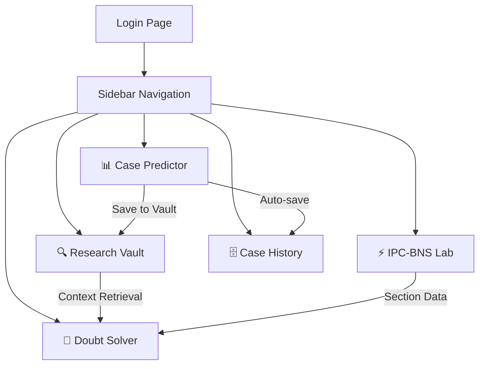

# Legal Research & Prediction Hub — Implementation Summary

## Overview
The system has been expanded from a single-page "Case Predictor" into a comprehensive **5-module Legal Research & Prediction Hub** with sidebar navigation, premium white UI, and full Supabase integration.

---

## Architecture



## Files Modified/Created

| File | Action | Purpose |
|------|--------|---------|
| `app.py` | **Rewritten** | Complete hub with 5 modules, sidebar nav, premium white theme |
| `migration.sql` | **Created** | Database schema for `cases_vault`, `student_queries`, `statutory_bridge` |
| `.streamlit/config.toml` | **Updated** | Premium white theme tokens |

---

## New Database Tables

> [!IMPORTANT]
> Run `migration.sql` in the **Supabase SQL Editor** before using the new features.

### `cases_vault`
Stores analyzed legal cases for the Research Vault.

| Column | Type | Description |
|--------|------|-------------|
| `id` | UUID | Primary key |
| `citation` | TEXT | Case citation |
| `title` | TEXT | Case title / filename |
| `summary` | TEXT | AI-extracted summary |
| `key_issues` | TEXT | Extracted facts / key issues |
| `ratio_decidendi` | TEXT | Court's reasoning |
| `relevant_sections_ipc` | TEXT | IPC sections found |
| `relevant_sections_bns` | TEXT | BNS equivalents |
| `uploaded_by` | TEXT | User email |
| `case_category` | TEXT | Criminal, Civil, Constitutional, etc. |
| `court_level` | TEXT | Supreme Court, High Court, etc. |
| `predicted_jurisdiction` | TEXT | AI prediction |
| `predicted_outcome` | TEXT | AI prediction |
| `outcome_confidence` | FLOAT | Confidence percentage |

### `student_queries`
Stores Doubt Solver conversation history.

| Column | Type | Description |
|--------|------|-------------|
| `user_id` | TEXT | User email |
| `query_text` | TEXT | Student's question |
| `ai_response` | TEXT | System's response |
| `related_case_id` | UUID | FK to cases_vault |

### `statutory_bridge`
IPC to BNS mapping with context.

| Column | Type | Description |
|--------|------|-------------|
| `ipc_section` | TEXT | IPC section (e.g., "Section 302") |
| `bns_equivalent` | TEXT | BNS equivalent (e.g., "Section 103 of BNS") |
| `change_description` | TEXT | What changed |
| `landmark_precedent` | TEXT | Relevant case law |

---

## Module Details

### 📊 Case Predictor (Enhanced)
- **New fields**: Case Category, Court Level, Statutory Tags
- **Save to Vault**: One-click save analyzed cases to the Research Vault
- **SHAP + BNS**: Decision drivers highlight BNS-translated keywords
- **Auto-save**: Predictions automatically saved to case_predictions table

### 🔍 Research Vault
- **Semantic Search**: Search cases by legal concepts, sections, or keywords
- **Case-at-a-Glance**: Expandable card with Facts, Arguments, Ratio Decidendi, IPC/BNS refs
- **Category Badges**: Color-coded badges for Criminal, Civil, Constitutional
- **Recent Cases**: Displays latest vault entries when no search query

### ⚡ IPC-BNS Transition Lab
- **Side-by-side Comparison**: Visual IPC → BNS comparison cards
- **Auto-populate**: Loads from `bns_mapping.json` into `statutory_bridge` table on first visit
- **Full Reference Table**: Browse all 80+ IPC-BNS mappings with change descriptions
- **Search**: Filter by section number or keyword (murder, theft, etc.)

### 💬 Doubt Solver Bot
- **Chat Interface**: Uses `st.chat_message` / `st.chat_input`
- **Retrieval-Based**: Searches Cases Vault + Statutory Bridge for context
- **Smart Matching**: Extracts section references and legal keywords from queries
- **History Saved**: All queries/responses saved to `student_queries` table

### 🗄️ Case History
- **Prediction Tab**: Shows all past AI predictions
- **Query Tab**: Shows all Doubt Solver conversations with expandable details
- **Column Config**: Clean table display with formatted columns

---

## How to Run

```bash
# 1. Run the migration in Supabase SQL Editor
#    Open migration.sql and execute it

# 2. Start the app
python -m streamlit run app.py
```

## Technical Stack
- **Frontend**: Streamlit 1.55 with custom CSS (Premium White theme)
- **AI Models**: InLegalBERT (law-ai/InLegalBERT) for jurisdiction + outcome prediction
- **XAI**: SHAP with NER-filtered legal entity highlighting
- **NLP**: spaCy (en_core_web_sm) for entity extraction
- **Database**: Supabase PostgreSQL with RLS policies
- **Navigation**: `st.sidebar.selectbox` multi-page routing
